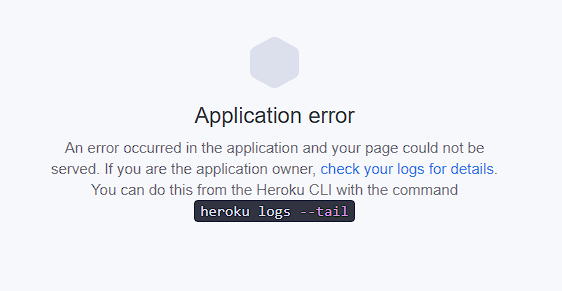

# DreamPortal
(by Robyn Soar)

DreamPortal is an online site to collate dreams and/or nightmares into written form to be able to share with others, or record them for personal view in the future.

View the live site [here]()

## Key Project Goals

- A website that has a simple user friendly interface, allowing users to use the site even when half-awake.
- To allow users to be able to journal their dream experiences and share with others.
- To allow users to comment on posts.
- To allow users to be able to bookmark their favourite dreams.

## Target Audience

The primary target audience for the site is:

- Ages of 13+ looking for a system to store their dreams/nightmares.
- Those who like to read and gain inspiration for their own writings elsewhere.

## Table of Contents

- [Features](#features)
    - [Site Wide](#site-wide)
    - [Landing Page](#landing-page)
    - [404 Error Page](#404-error-page)
    - [Existing Features](#existing-features)
    - [Features Left to Implement](#features-left-to-implement)
- [Agile Methodology](#agile-methodology)
    - [User Stories](#user-stories)
    - [Kanban Board](#kanban-board)
- [Design](#design)
    - [Flowchart](#flowchart)
    - [Colour Palette](#terminal-sizing)
    - [Google Fonts](#google-fonts)
    - [Technologies Used](#technologoies-used)
- [Testing](#testing)
    - [Responsiveness](#responsiveness)
    - [Accessibility](#accessibility)
    - [Lighthouse Testing](#lighthouse-testing)
    - [User Story Testing](#user-story-testing)
    - [Functional Testing](#functional-testing)
    - [Validator Testing](#validator-testing)
    - [Fixed Bugs](#fixed-bugs)
    - [Unfixed Bugs](#unfixed-bugs)
- [Deployment](#deployment)
    - [Version Control](#version-control)
    - [Deployment to Heroku](#deployment-to-heroku)
- [Credits](#credits)
    - [Walkthrough Code](#walkthrough-code)
    - [References](#references)
    - [Acknowledgements](#acknowledgements)
- [Author](#author)

## Features

### Site Wide


### Landing Page


### 404 Error Page


### Existing Features


### Features Left to Implement


[Return to Table of Contents](#table-of-contents)

## Agile Methodology

### User Stories


### Kanban Board


[Return to Table of Contents](#table-of-contents)

## Design

### Flowchart


### Colour Palette


### Google Fonts

[Google Fonts](https://fonts.google.com/) was used to import fonts for the site, these include:

- "Nunito", serif: Used for the site logo and post titles.
- "Raleway", serif: Used for all other text content site wide.

### Technologies Used

- GitHub
    - Hosts the DREAMPORTAL repo, used for version control and project management. (GitHub issues, Kanban board)
- Gitpod
    - Used for development of the site as well as commit and pushing code throughout.
- [Heroku](https://dashboard.heroku.com/apps)
    - Used for deployment of DREAMPORTAL.
- HTML
    - The main language used to provide users with the front-end user interface.
- CSS
    - Used to style the site, working alongside Bootstrap from within a static file.
- Bootstrap
    - CSS framework used for quick and easy styling of site.
- Django 4.2.18
    - Python framework used to implement logic.
- PostgreSQL
    - Database used to store all data.
- Whitenoise
    - Python library for handling static files.
- Django Summernote
    - Used to provide extra editing tools to Django admin panel.
- [Google Fonts]()
    - Used to import fonts to be used within the site.
- [Font Awesome](https://fontawesome.com/)
    - Used for icons within the site, a Bootstrap CDN was used to make sure it worked along side Bootstrap.
- [rawpixel](https://www.rawpixel.com/image/556822/vintage-christmas-star)
    - Used for default post image when user doesn't select their own.

[Return to Table of Contents](#table-of-contents)

## Testing

### Responsiveness


### Accessibility


### Lighthouse Testing


### User Story Testing


### Functional Testing


### Validator Testing


### Fixed Bugs

__Name change / Deployment Bug__



While deploying the app for the first time on Heroku, there was an 'Application' Error.

As Heroku informed, I tried to use `heroku logs --tail` and received the following message:

`›   Error: The following error occurred:
 ›     Missing required flag app
 ›   See more help with --help`

Searching for my app with `heroku logs --tail --app dream-portal-app" I was greeting with a message to follow a link to authorise login via browser. I wasn't able to do this as an error message of "IP address mismatch" showed and I needed to authorise within the terminal rather than the browser.

[Heroku CLI Commands](https://devcenter.heroku.com/articles/heroku-cli-commands)
- List of commands used to export API key and connect it to the project.

API Key was found within the Settings > Accounts section of Heroku personal profile.

Further investigation also showed I'd neglected to insert a blank space between authorised hosts in the settinngs.py file.


### Unfixed Bugs


[Return to Table of Contents](#table-of-contents)

## Deployment

### Version Control

The site was created using the Gitpod editor and pushed to GitHub to the remote repository 'dream-portal'

The following git commands were used throughout development to push code to the remote repository:

```git add <file>``` - This command was used to add the file(s) to the staging area before they are commited.

```git commit -m "commit message"``` - This command was used to commit changes to the local repository queue ready to be pushed.

```git push``` - This command was used to push all committed code to the remote repository 'dream-portal' on GitHub.

### Deployment to Heroku

- Ensure installation of dependacies required for the project to run by typing ```python3 install [dependency]~=[version]```. e.g. gunicorn.
- Creat a Procfile in the root directory which contains the code ```web: gunicorn dream-portal.wsgi```.
- Make sure that Heroku will install dependencies used by typing ```pip3 freeze > requirements.txt``` into the terminal and hit the "Enter" key.
    - This is to be done after any new dependencies are installed.
- Make sure to migrate any changes to models before deploying.
    - Type ```python3 manage.py makemigrations``` into the terminal.
    - If any migrations are made, type ```python3 manage.py migrate```.
- Collect all static files by typing ```python3 manage.py collectstatic``` into the terminal and hit the "Enter" key.
- Make sure DEBUG is set to 'False' in the settings.py file.
- **Git add .** **git commit -m "[commit message]"** and **git push** the changes to GitHub.
- Go to Heroku.com and sign up for an account or log in if you already have one.
- Click "Create new app".
- Give the app a unique name corresponding to your project name, select region and "Create app".
- Go to "Settings" and scroll to "Config Vars".
- Reveal and create Config Vars, any confidental information from within the eny.py file to be added.
    - DATABASE_URL: (Confidental Value)
    - SECRET_KEY: (Confidental Value)
- Click "Deploy" in the navbar at the top of the page.
- Select "GitHub" within the section called "Deployment method".
- Click "Connect to GitHub".
- Under "Connect to GitHub, search for your repository name and click "Connect".
- Scroll down the page to choose either "Automatic deploys" and click "Enable Automatic Deploys" to enable Heroku to rebuild the app when a new change is pushed to GitHub, or "Manual deploy" and click "Deploy Branch" to deploy manually.
- When deployment is completed and you're notified that the deployment was successful, click "View" to see your deployed project.

[Return to Table of Contents](#table-of-contents)

## Credits

### Walkthrough Code

- [CI - I Think Therefore I Blog](https://learn.codeinstitute.net/courses/course-v1:CodeInstitute+FSD101_WTS+4/courseware/713441aba05441dfb3a7cf04f3268b3f/824fccecd0fe4e44871eeabcbf69d830/)
    - For basic set up and basis for the post and comments model and views.
- [Daisy Mcgee - Django Recipe Sharing Tutorial](https://www.youtube.com/watch?v=sBjbty691eI&list=PLXuTq6OsqZjbCSfiLNb2f1FOs8viArjWy&index=2)
    - For extra understanding of Django.

### References

- [Django Documentation](https://docs.djangoproject.com/en/5.1/)
    - [Settings](https://docs.djangoproject.com/en/4.2/ref/settings/#staticfiles-dirs-prefixes)
    - [Model field reference](https://docs.djangoproject.com/en/5.1/ref/models/fields/)
- [Bootstrap 5 Documentation](https://getbootstrap.com/docs/5.0/getting-started/introduction/)
- Tutor Support
    - Admin panel login issue
- [DEV - How to add like/unlike button](https://dev.to/radualexandrub/how-to-add-like-unlike-button-to-your-django-blog-5gkg)
    - Guidance for Like button

### Acknowledgements


[Return to Table of Contents](#table-of-contents)

## Author

Robyn Soar
robyn999@hotmail.co.uk