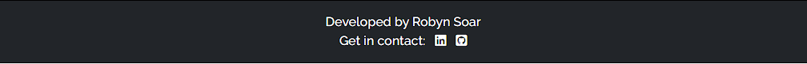
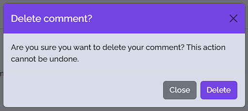
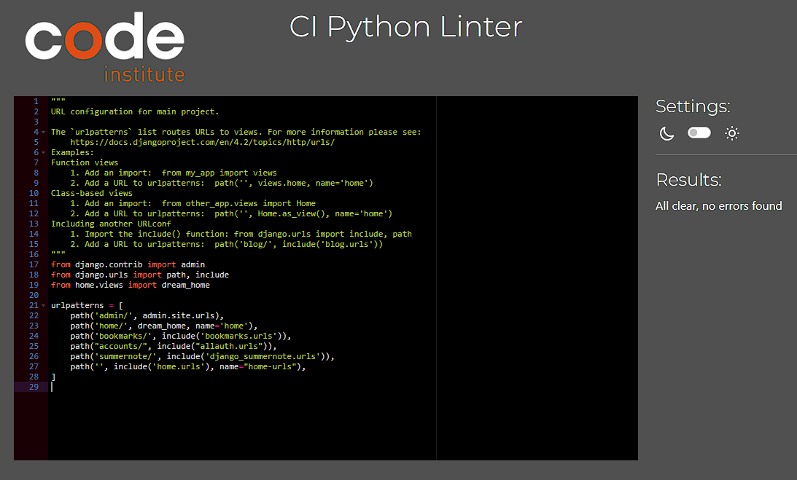
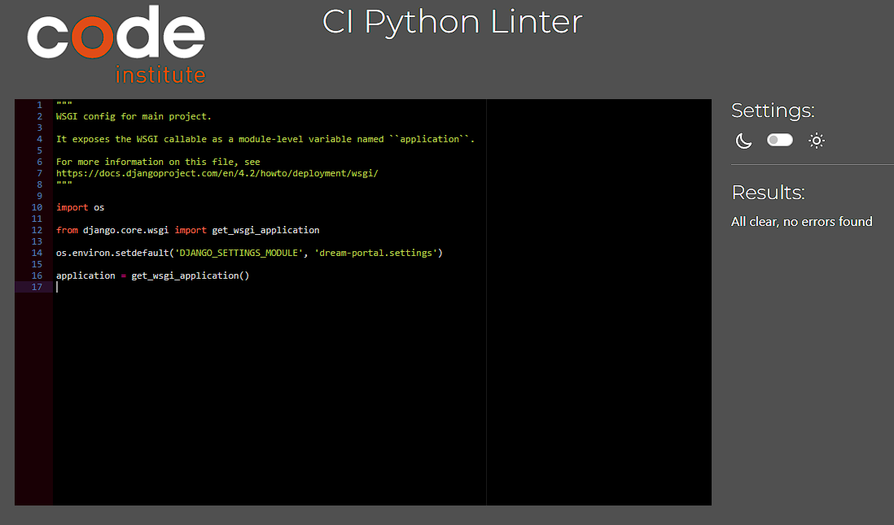

# DreamPortal
(by Robyn Soar)

DreamPortal is an online blog site to capture dreams and/or nightmares into written form to be able to share with others, be able to comment on them, like and bookmark.

View the live site [here]()


## Key Project Goals

- A website that has a simple user friendly interface, allowing users to use the site even when half-awake.
- To allow users to be able to read dream stories.
- To allow users to comment on posts.
- To allow users to be able to bookmark their favourite dreams.
- To allow users to be able to like posts.

## Target Audience

The primary target audience for the site is:

- Ages of 13+ who like to read.
- Those who like to read and gain inspiration for their own writings elsewhere.

## Table of Contents

- [Features](#features)
    - [Site Wide](#site-wide)
    - [Landing Page](#landing-page)
    - [Post Details](#post-details)
    - [Bookmarks](#bookmarks)
    - [Authorisation](#authorisation)
    - [Existing Features](#existing-features)
    - [Features Left to Implement](#features-left-to-implement)
- [Agile Methodology](#agile-methodology)
    - [User Stories](#user-stories)
    - [Kanban Board](#kanban-board)
- [Design](#design)
    - [Wireframes](#wireframes)
    - [Colour Palette](#terminal-sizing)
    - [Google Fonts](#google-fonts)
    - [Technologies Used](#technologies-used)
- [Testing](#testing)
    - [User Story Testing](#user-story-testing)
    - [Functional Testing](#functional-testing)
    - [Validator Testing](#validator-testing)
    - [Fixed Bugs](#fixed-bugs)
- [Deployment](#deployment)
    - [Version Control](#version-control)
    - [Deployment to Heroku](#deployment-to-heroku)
- [Credits](#credits)
    - [Walkthrough Code](#walkthrough-code)
    - [References](#references)
    - [Acknowledgements](#acknowledgements)
- [Author](#author)

## Features

### Site Wide

__Favicon__
- The favicon is a little moon and star in the websites main purple accent colour.
- Provides an image in the tabs header to allow the user to easily identify and associate with DREAMPORTAL.


__Logo__
- Contains a link to the Home page from any other page.


__Navbar__
- Responsive
    - Fully responsive navigational links that collapse into a menu icon on smaller viewports.


- Logged Out
    - Includes links to different pages.
    - Sign Up and Login buttons when not logged in.
    - Displays user log in status and username at all times.


- Logged In
    - Includes 'Bookmarks' page, which can only be viewed by authorised users.
    - Logout button when logged in.
    - Displays user logged in status and username at all times.


__Welcome Banner__
    - Welcomes new and returning users to the site.
    - Intruiges the user and provides information about the site's purpose.
    - Gives them information on what you're able to do on the site.


__Footer__
    - Includes information and links to the site developer's social media profiles.
    - Links open in a new tab.
    - Aria tags provided aid in accessibility.



__Alerts__

- Messages are displayed in the top center of the viewport, just below the navbar.
- They are feedback provided to the user upon doing certain actions.
- Successful confirmation messages are displayed in green for easy recognition, these display upon success of the following actions:
    - Logging in
    - Signing Up
    - Logging out
    - Leaving a comment
    - Editing a comment
    - Deleting a comment
    - Liking a post
    - Bookmarking a post
    - Deleting a bookmark
- User can click on the 'X' to close the message.


- Error messages are displayed in red upon meeting an error. Such as logging out while on the bookmarks page (Which cannot be viewed without being authorised).


### Landing Page / Blog Post List

__Blog Post List__

- All published posts are displayed on a preview card to the user. In order from newest at the top of the page, to oldest.
- Each card contains:
    - Author: Author of the original post
    - Image: This gives each card it's most easily recogniseable quality, as the author can use an image to hint at a scene or feeling of their dream. If the author doesn't choose an image, a placeholder image will be shown as default.
    - Post Title: This is the title of the dream story, each title can be clicked on to be taken to see the full details of the post.
    - Post Excerpt: This is a small sample of text from the full post or a short description of what the full post entails.
    - Date and Time: The exact date and time of post creation.


__Pagination__

- The blog post cards are displayed with 6 posts per page to help manage the flow of information, and reduces the amount of mindless scrolling where a user can easily lose their position.
- On screens smaller than tablet size, posts can be seen in a single column. Whereas on tablet screen and larger, posts are displayed in 3 columns. Allowing pictures and text to stay uniform and responsive to all viewports.


__Page Navigation__

- Navigation buttons are at the bottom center of each page in the blog post list.
- If there is another page to go to, it will show a 'Next' button, and the same for if there's previous pages, it will show a 'Previous'.
- Both give feedback to the user if hovering over the button or if active.


### Post Details


__Comments__

- No comments
    - When a post has no comments listed, a small piece of text will inform the user that there is no comments, and prompts them to leave their own.


- Leave a comment (Logged out)
    - To leave a comment, users must be logged in - they will not be authorised to view the text-area to write the comment until then.
    - If logged out, user can click on the link in this section to be taken straight to the login page.
    - Users will be brought back to the page they were on before login.


- Leave a comment (Logged In)
    - When logged in, users will be authorised to leave a comment.
    - Comments will list the Author and date / time of creation.
    - Comments are listed from newest at the top to oldest.


- Edit a comment
    - To edit a comment, users must be logged in, and be the author of the comment.
    - Authorisation will only allow a user to edit their own comments.
    - Once a comment has been edited, the text (edited) will show up within the comment.


- Delete a comment
    - To delete a comment, users must be logged in, and be the author of the comment.
    - Authorisation will only allow a user to delete their own comments.
    - Once a comment has been deleted, this cannot be undone.
    - A confirmation modal will pop up to the user upon clicking 'delete', and they will be asked to confirm if they wish to delete.



__Back To Top__

- 'Back To Top' buttons can be found under the post content and under the comments section to allow the user a pleasant experience while navigating the post details page.


__Comment Counter / Likes / Bookmark__

- Post info and button bar
    - Within the viewport of the users device, a comment counter, a likes counter/button, a bookmarks button, and a view comments button can be seen.
    - The 'View Comments' button can be clicked to take the user to the comments section. This is to give the user a better experience navigating the post details page. Especially when the post content is lengthy.
    - To leave a comment, like or bookmark a post, the user will have to be logged in, and will be prompted to do so if they try to use these buttons.
    - Comments counter counts the amount of comments made on the individual post. This shows to all users even when logged out.
    - Like counter/button counts the amount of likes a post has, but also is used to 'like' a post. Styling makes this intuitive for the user.
        - Like Font Awesome icon is 'hollow' when unliked and 'filled' when already previously liked by the user.
    - Bookmark button, 'bookmarks' a post for the user to view later.
        - Bookmark Font Awesome icon is 'hollow' when not bookmarked and 'filled' when already previously added to bookmarked posts.


### Bookmarks

- Only users that are logged in are able to see bookmarks, if a user logs out on the bookmarks page. They are redirected to the login page.
- Bookmarks will only be shown to the the individual user that bookmarked the posts while logged in.

- No Bookmarks
    - If there are yet to be any bookmarks made by the user, there is a text display to prompt the user to make a bookmark and they'll see them listed.


- Bookmark List
    - A user can bookmark a post and view them in this list.
    - Bookmarks display the post Title and Author.
    - Clicking on the title will take the user back to the post they bookmarked.
    - To remove a bookmark, a user can click the 'delete' button, and be prompted with a modal.


- Delete Bookmark Modal
    -The delete bookmark modal will appear once a user clicks 'delete' and will ask the user to confirm if they wish to delete the bookmark.


### Authorisation

__Sign Up__

- The sign up page begins addressing the user, asking if they have an account and using a link to guide them to the appropriate form.
- It explains why they need to sign up, and to be authorised to more functionality.
- Clearly explains what information is needed and goes into more specifics where needed.


- When inputting data into the fields, the form will make sure all fields are appropriately completed.
- If forms are incomplete/ have mismatching passwords etc the form will guide the user to fix the issue.
- Provides a cancel button to the user should they change their mind, and returns them to the page they were previously on.


__Log In__

- Upon entering the log in page, users will be welcomed back to the site.
- It reinstates whhy you would need to log in and for what extra functions.
- Guides the user back to the sign up form if they haven't completed sign up.
- Proves the user the ability to have the site 'rememeber' them so they don't need to log in again.
- Provides a cancel button to the user should they change their mind, and returns them to the page they were previously on.


__Log Out__

- When user clicks to log out, the log out page confirms with the user if they would like to proceed.
- Provides a cancel button to the user should they change their mind, and returns them to the page they were previously on.


### Existing Features


### Features Left to Implement


[Return to Table of Contents](#table-of-contents)

## Agile Methodology

### User Stories


### Kanban Board


[Return to Table of Contents](#table-of-contents)

## Design

### Wireframes

__Desktop__

(Wireframes: left > right)
- Landing page / post list
- Post detail
- Bookmarks
- Sign Up
- Log In
- Log Out


__Mobile__


### Colour Palette

The following colour palette was used thorugh the site, providing a simple and gentle selection of colours. Keeping in mind that users may be just waking when using the site.

- #6D747D - Branding / Navbar
- #D7DDE8 - Main background coloru site wide
- #B9B8ED - Light accents for buttons
- #6B57E3 - Key highlights and attention-grabbing elements
- #222529 - Footer / text main text colour


### Google Fonts

[Google Fonts](https://fonts.google.com/) was used to import fonts for the site, these include:

- "Nunito", serif: Used for the site logo and post titles.
- "Raleway", serif: Used for all other text content site wide.

### Technologies Used

- GitHub
    - Hosts the DREAMPORTAL repo, used for version control and project management. (GitHub issues, Kanban board)
- Gitpod
    - Used for development of the site as well as commit and pushing code throughout
- [Heroku](https://dashboard.heroku.com/apps)
    - Used for deployment of DREAMPORTAL
- HTML
    - The main language used to provide users with the front-end user interface
- CSS
    - Used to style the site, working alongside Bootstrap from within a static file
- Bootstrap
    - CSS framework used for quick and easy styling of site
- Django 4.2.18
    - Python framework used to implement logic
- Django Allauth
    - Authentication library for user authentication
- Django Crispy Forms
    - Render user POST requests
- Django Summernote
    - Used to provide extra editing tools to Django admin panel
- PostgreSQL
    - Database used to store all data
- Whitenoise
    - Python library for handling static files
- [Google Fonts](https://fonts.google.com/)
    - Used to import fonts to be used within the site
- [Font Awesome](https://fontawesome.com/)
    - Used for icons within the site, a Bootstrap CDN was used to make sure it worked along side Bootstrap
- [rawpixel](https://www.rawpixel.com/image/556822/vintage-christmas-star)
    - Used for default post image when user doesn't select their own
- [Coolors](https://coolors.co/)
    - Colour palette swatches
- [Icons8](https://icons8.com/)
    - Favicon image
- [Pexels](https://www.pexels.com/)
    - Used to populate the blog posts
- [Tinypng](https://tinypng.com/)
    - To compress image assets to increase site performance
- [Image Resizer.com](https://imageresizer.com/)
    - To resize images to increase site performance
- [Techsini - Multi Mockup](https://techsini.com/multi-mockup/index.php)
    - To show the sites responsivity across a variety of devices

[Return to Table of Contents](#table-of-contents)

## Testing

### User Story Testing


### Functional Testing


### Validator Testing

__CI Python Linter__

- There are no issues raised in the [Python Linter]() for any of the .py files:






__JShint__

- [JShint](https://jshint.com/) flags Bootstrap as an 'Underfined Variable', this is used in the walkthrough and is cause by cross referencing scripts, this is not considered an issue.


__HTML__

__WAVE Compatibility__


__Lighthouse__


### Fixed Bugs

__Name change / Deployment Bug__


While deploying the app for the first time on Heroku, there was an 'Application' Error.

As Heroku informed, I tried to use `heroku logs --tail` and received the following message:

`›   Error: The following error occurred:
 ›     Missing required flag app
 ›   See more help with --help`

Searching for my app with `heroku logs --tail --app dream-portal-app" I was greeting with a message to follow a link to authorise login via browser. I wasn't able to do this as an error message of "IP address mismatch" showed and I needed to authorise within the terminal rather than the browser.

[Heroku CLI Commands](https://devcenter.heroku.com/articles/heroku-cli-commands)
- List of commands used to export API key and connect it to the project.

API Key was found within the Settings > Accounts section of Heroku personal profile.

Further investigation also showed I'd neglected to insert a blank space between authorised hosts in the settings.py file.

__No 'Objects' Member Bug__

Pylint extension flagging an error/warning. Stating ``Class 'Post' has no 'objects' member`` and ``Class 'Bookmark' has no 'objects' member``.


Found that this is more of a warning from the IDE, as Django adds the objects property dynamically to all model classes, and thus the IDE doesn't know about it through simply looking at class declaration.

Added ``objects = models.Manager()`` within models to get rid of this warning.

With help from [this thread](https://stackoverflow.com/questions/45135263/class-has-no-objects-member) on stackoverflow to combat this warning.

[Return to Table of Contents](#table-of-contents)

## Deployment

### Version Control

The site was created using the Gitpod editor and pushed to GitHub to the remote repository 'dream-portal'

The following git commands were used throughout development to push code to the remote repository:

```git add <file>``` - This command was used to add the file(s) to the staging area before they are commited.

```git commit -m "commit message"``` - This command was used to commit changes to the local repository queue ready to be pushed.

```git push``` - This command was used to push all committed code to the remote repository 'dream-portal' on GitHub.

### Deployment to Heroku

- Ensure installation of dependacies required for the project to run by typing ```python3 install [dependency]~=[version]```. e.g. gunicorn.
- Creat a Procfile in the root directory which contains the code ```web: gunicorn dream-portal.wsgi```.
- Make sure that Heroku will install dependencies used by typing ```pip3 freeze > requirements.txt``` into the terminal and hit the "Enter" key.
    - This is to be done after any new dependencies are installed.
- Make sure to migrate any changes to models before deploying.
    - Type ```python3 manage.py makemigrations``` into the terminal.
    - If any migrations are made, type ```python3 manage.py migrate```.
- Collect all static files by typing ```python3 manage.py collectstatic``` into the terminal and hit the "Enter" key.
- Make sure DEBUG is set to 'False' in the settings.py file.
- **Git add .** **git commit -m "[commit message]"** and **git push** the changes to GitHub.
- Go to Heroku.com and sign up for an account or log in if you already have one.
- Click "Create new app".
- Give the app a unique name corresponding to your project name, select region and "Create app".
- Go to "Settings" and scroll to "Config Vars".
- Reveal and create Config Vars, any confidental information from within the eny.py file to be added.
    - DATABASE_URL: (Confidental Value)
    - SECRET_KEY: (Confidental Value)
- Click "Deploy" in the navbar at the top of the page.
- Select "GitHub" within the section called "Deployment method".
- Click "Connect to GitHub".
- Under "Connect to GitHub, search for your repository name and click "Connect".
- Scroll down the page to choose either "Automatic deploys" and click "Enable Automatic Deploys" to enable Heroku to rebuild the app when a new change is pushed to GitHub, or "Manual deploy" and click "Deploy Branch" to deploy manually.
- When deployment is completed and you're notified that the deployment was successful, click "View" to see your deployed project.

[Return to Table of Contents](#table-of-contents)

## Credits

### Walkthrough Code

- [CI - I Think Therefore I Blog](https://learn.codeinstitute.net/courses/course-v1:CodeInstitute+FSD101_WTS+4/courseware/713441aba05441dfb3a7cf04f3268b3f/824fccecd0fe4e44871eeabcbf69d830/)
    - For basic set up and basis for the post and comments model and views.
- [Daisy Mcgirr - Django Recipe Sharing Tutorial](https://www.youtube.com/watch?v=sBjbty691eI&list=PLXuTq6OsqZjbCSfiLNb2f1FOs8viArjWy&index=2)
    - For extra understanding of Django.

### References

- [Django Documentation](https://docs.djangoproject.com/en/5.1/)
    - [Settings](https://docs.djangoproject.com/en/4.2/ref/settings/#staticfiles-dirs-prefixes)
    - [Model field reference](https://docs.djangoproject.com/en/5.1/ref/models/fields/)
- [Bootstrap 5 Documentation](https://getbootstrap.com/docs/5.0/getting-started/introduction/)
- Tutor Support
    - Admin panel login issue
- [DEV - How to add like/unlike button](https://dev.to/radualexandrub/how-to-add-like-unlike-button-to-your-django-blog-5gkg)
    - Guidance for Like button
- [Stack Overflow - ](https://stackoverflow.com/questions/806835/django-redirect-to-previous-page-after-login)
    - Used for guidance on how to redirect a user to the page they were previously on before log in
- [mdn_](https://developer.mozilla.org/en-US/docs/Web/API/Element/scrollIntoView)
    - Used for javascript .scrollIntoView guidance to move user to comment edit text area on clicking 'edit' button
- [Stack Overflow - Cancel Auth Button](https://stackoverflow.com/questions/8067510/onclick-javascript-to-make-browser-go-back-to-previous-page)
    - Guidance on implemening a simple cancel button for auth pages to return users to previous page
- [Stack Overflow](https://stackoverflow.com/questions/48508750/how-to-force-https-in-a-django-project-using-cloudinary)
    - Guidance on how to fix 'Mixed Content' error due to cloudinary image security

### Acknowledgements

Thank you to my friends and classmates giving me the best pep talks to keep my spirits high.

Especially to my fantastic mentor [Gareth McGirr](https://github.com/Gareth-McGirr), for keeping my head on straight and guiding me in the right direction.

[Return to Table of Contents](#table-of-contents)

## Author

Robyn Soar
robyn999@hotmail.co.uk